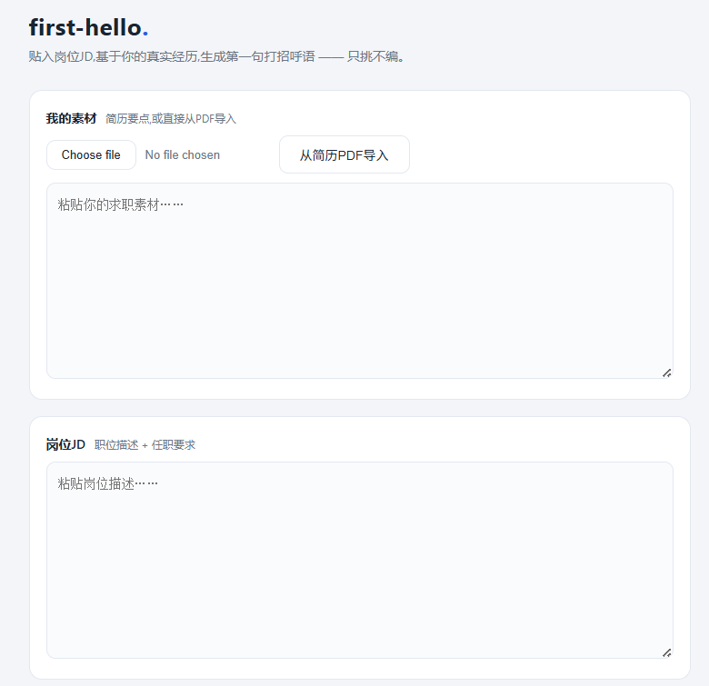
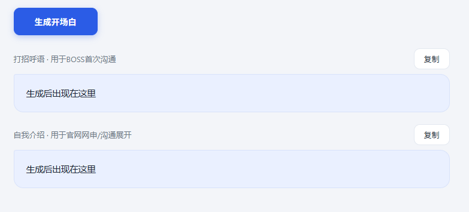

# icebreaker-hr

> 破冰式求职开场白生成器 · 应用界面显示名为 first-hello

**贴入岗位 JD,基于你的真实经历,生成求职的第一句话 —— 只挑不编。**

找实习/求职时,每天要对不同岗位反复写打招呼语和自我介绍:泛泛的模板没人回,逐个手写又太耗时。icebreaker-hr 读取你的简历素材和目标岗位的 JD,找出两者之间**最独特的一条匹配线**,生成一条 50 字内的打招呼语(用于 BOSS 直聘等首次沟通)和一段 250~300 字的自我介绍(用于官网网申),供你审阅、微调后发出。




## 功能

- **PDF 简历导入**:上传简历 PDF,自动抽取文字填入素材框,可在此基础上补充细节(简历是压缩包,素材可以更厚)
- **匹配线挑选**:不是罗列你最大的头衔,而是找出与该岗位业务最直接相关的那段经历(哪怕只是一个课程项目),并说清"我的经历和你们做的事有什么关系"
- **流式输出**:双卡片接力式渲染,打招呼语和自我介绍分框生成、各自一键复制(不含标题,粘贴即用)
- **场景化格式**:打招呼语第一句融合身份与匹配点(学校+专业必带,方向按岗位相关性附上,隐去年级与学位头衔),结尾按需给出到岗时间;自我介绍按网申表单要求分段组织
- **生成历史**:每次生成自动保存,可回看给哪个岗位写过什么,一键复制或把当时的 JD 填回重新生成(数据只存在你本机浏览器,不上传)

## 快速上手

**1. 安装依赖**

```bash
pip install -r requirements.txt
```

**2. 配置环境变量**(兼容任意 OpenAI 接口格式的模型服务,如 DeepSeek、GLM 等)

Windows PowerShell:

```powershell
[Environment]::SetEnvironmentVariable("LLM_API_KEY",  "你的API密钥", "User")
[Environment]::SetEnvironmentVariable("LLM_BASE_URL", "服务商接口地址", "User")
[Environment]::SetEnvironmentVariable("LLM_MODEL",    "模型名称", "User")
```

macOS / Linux(写入 `~/.zshrc` 或 `~/.bashrc`):

```bash
export LLM_API_KEY="你的API密钥"
export LLM_BASE_URL="服务商接口地址"
export LLM_MODEL="模型名称"
```

**验证是否生效**(重新打开终端后运行,三条都能打印出值才算配置完成):

Windows PowerShell:

```powershell
echo $env:LLM_API_KEY
echo $env:LLM_BASE_URL
echo $env:LLM_MODEL
```

macOS / Linux:

```bash
echo $LLM_API_KEY
echo $LLM_BASE_URL
echo $LLM_MODEL
```

> ⚠️ 常见坑:设置环境变量后必须**关闭并重新打开终端**才生效;如果在 VS Code 内置终端运行,需要**整个重启 VS Code**,只新建终端标签页无效。如果 echo 输出为空,说明变量没设上,回到上一步重新设置。

**3. 启动**

```bash
python app.py
```

浏览器打开 `http://127.0.0.1:5000`,上传简历 PDF(或手动粘贴素材)→ 粘贴岗位 JD → 生成 → 分别复制。

> BOSS 直聘网页版禁止复制 JD。绕开方法:在岗位页按 Ctrl+P 调出打印预览,预览里的文本可以直接选中复制;也可以用 App 的分享功能转发给自己,或截图后用微信/QQ 的"提取文字"。

## 零成本本地部署(可选,需设备支持)

icebreaker-hr 调用的是**兼容 OpenAI 接口格式**的模型服务,而 [Ollama](https://ollama.com) 恰好也提供同样格式的本地接口——这意味着你可以把模型跑在**自己电脑上**,不改一行代码,只换三个环境变量,从此**零 API 成本、简历数据不出本机、断网也能用**。

**1. 安装 Ollama 并下载一个模型**

到 [ollama.com](https://ollama.com) 下载安装,然后拉取模型(模型文件存在本地硬盘,占几 GB 到几十 GB):

```bash
ollama pull qwen2.5        # 约 4.7GB,7B 参数,质量较稳
# 设备吃力的话换更小的模型:
ollama pull qwen2.5:3b     # 约 2GB
```

**2. 把三个环境变量指向本地 Ollama**(设置方式与上文相同,重开终端生效)

```
LLM_BASE_URL = http://localhost:11434/v1
LLM_MODEL    = qwen2.5      # 与你 pull 的模型名保持一致
LLM_API_KEY  = ollama       # 本地不校验,随便填一个非空值即可
```

其余步骤不变,`python app.py` 照常启动。

> ⚠️ **需要设备支持——这条路不是人人划算。** 本地推理吃内存和显卡:
> - **内存**:7B 模型建议 **16GB 以上**内存;8GB 内存的机器基本只能跑 3B 以下的小模型。
> - **显卡**:有 **NVIDIA 独显**才能显著加速;核显 / 无独显只能纯 CPU 硬算,生成会明显变慢。
> - **质量**:能塞进低配设备的小模型,未必能稳定遵循本项目较复杂的提示词规则(分栏格式、方向取舍等),效果通常不如云端大模型。
>
> 一句话:**设备够强(大内存 + 独显)→ 本地又免费又私密;设备一般 → 老实用云端 API,本工具每次生成也只花零点几分钱。**

## 设计原则

**只挑不编。** AI 的角色是"选料师"而不是"写手":它只能从你提供的真实素材中挑选、组织和转述,严禁编造、夸大或推测素材中不存在的经历。如果素材与岗位是能力迁移型匹配(没有直接对口经历),它会如实以迁移角度表达,而不是假装熟悉。生成内容的每一句话,都应该能在你的素材里找到出处。

**生成归工具,发送归人。** 本工具不做任何自动投递、自动发送——发出前的最后一眼和最后一击,永远由你完成。这既是对平台规则的尊重,也是对沟通对象的尊重:HR 收到的每一条消息,都经过了一个真人的确认。

## 提示词不是写出来的,是测出来的

核心 system prompt 经过十余轮真实岗位 JD 的实测迭代。举一个典型的演进(测试素材:一位做过 RAG 课程问答机器人的学生,目标岗位:LLM 应用开发实习):

**早期版本生成的开场:**
> 您好,我是XX大学XX专业大三学生,做过校园小程序后端、RAG问答机器人和数据可视化项目,想应聘贵司LLM应用实习。

**现行版本生成的开场(同一素材、同一岗位):**
> 您好,我是XX大学软件工程学生,做过基于课程资料的 RAG 问答机器人,重点在让回答只基于知识库并减少幻觉,和贵司知识库问答方向很贴近,不知是否方便进一步沟通?

变化的核心:从"罗列经历名词"到"第一句融合身份与最独特匹配点,说清我的经历和你们做的事有什么关系"。中间的每一版都修正了一个真实翻车点,例如:

- 自我扣分句式("我在XX方面仍有提升空间")→ 迁移型匹配如实表达,禁止替对方扣分
- 生成结果像论文摘要 → 要求即时通讯口语姿态,技术细节点到为止
- 收尾"想和您聊聊岗位匹配度"反客为主 → 收尾必须是礼貌请求沟通机会
- 第一句报出"大二"自曝低年级标签 → 打招呼语隐去年级,由毕业时间/可实习时长传递阶段信息
- 学历照抄"XX学士(荣誉)(XX方向)"全称、或在AI岗漏报AI方向 → 学校+专业固定必带,方向默认带出、仅明显无关时省略,学位与荣誉字样一律不写

一条经验:模型对"固定结构型"规则(必须XX)执行很稳,对"条件判断型"规则(如果A则B)容易漏——把重要的条件规则改写成"默认做,除非明显不该做",执行率会显著提升。

如果你 fork 本项目调整提示词,建议沿用同样的方法:用你真实要投的 JD 测试,把翻车点写成规则。

## 技术栈

Flask(后端)· 原生 HTML/CSS/JS(前端,流式渲染)· OpenAI 兼容接口(可换后端)· pypdf(简历解析)

## 许可

[MIT](LICENSE) —— 随意使用、修改、二次分发,保留版权声明即可,作者不承担任何担保与责任。欢迎 fork 来调整提示词。